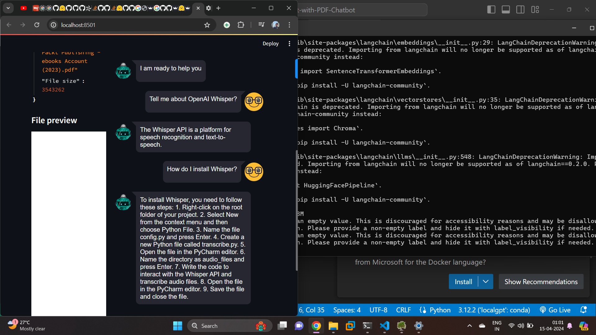

# Chat locally

has issues like we have o install the docker container first then interact

# trying Groqchatbot

https://github.com/InsightEdge01/GroqPDFFastChatbot

ollama pull nomic-*

streamlit run app.py
 
# Medical chatbot

https://www.youtube.com/watch?v=kXuHxI5ZcG0

has an issue with pwd command can onl run in linux

# instaling localgpt

https://www.youtube.com/watch?v=9u5rcRHqrrQ&t=15s

using python nvironement 3.8

# THe amazing worl of fineuning llama
https://github.com/AIAnytime/Chat-with-PDF-Chatbot

# llmware rag demo

https://github.com/AIAnytime/llmware-RAG-Demo-App

first glimmer of success

# quantisation

Quantisation is a technique to reduce the computational and memory cost of running inference by representing the weights and activations with low precision data types like 8 bit integer instead of the usual 32 bit floating point

reducing bits mean less storage and less energy

https://huggingface.co/blog/os-llms

# trying on RAG

https://github.com/AllAboutAI-YT/easy-local-rag?tab=readme-ov-file

first install pytorch cpuonly

next error was regarding ollamma we need to pull the model first

this needed to be done yesterday.

# Trying gpt4all

https://webcache.googleusercontent.com/search?q=cache:https://medium.com/rahasak/build-rag-application-using-a-llm-running-on-local-computer-with-gpt4all-and-langchain-13b4b8851db8

# using ollama

https://webcache.googleusercontent.com/search?q=cache:https://medium.com/rahasak/build-rag-application-using-a-llm-running-on-local-computer-with-ollama-and-langchain-e6513853fda0

https://gitlab.com/rahasak-labs/ollama

# privategpt

