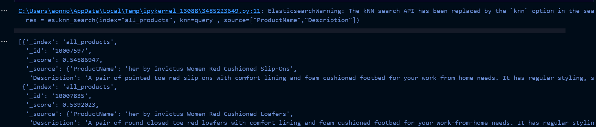
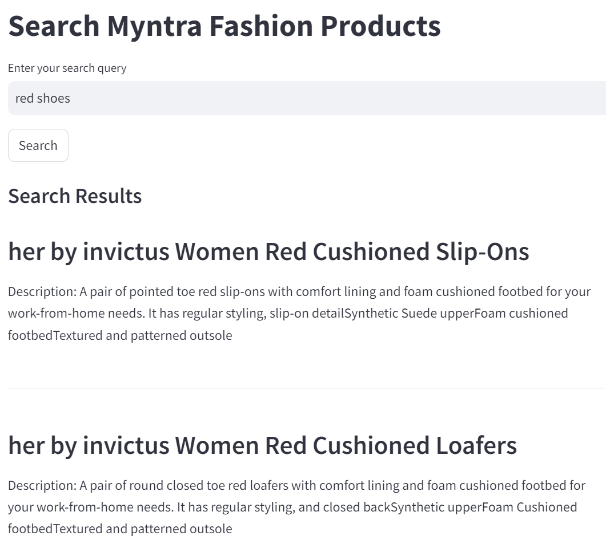
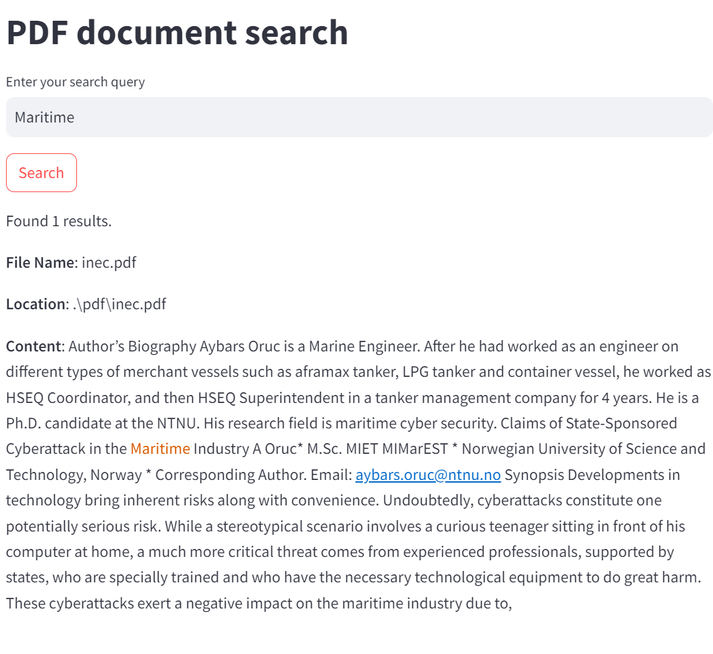
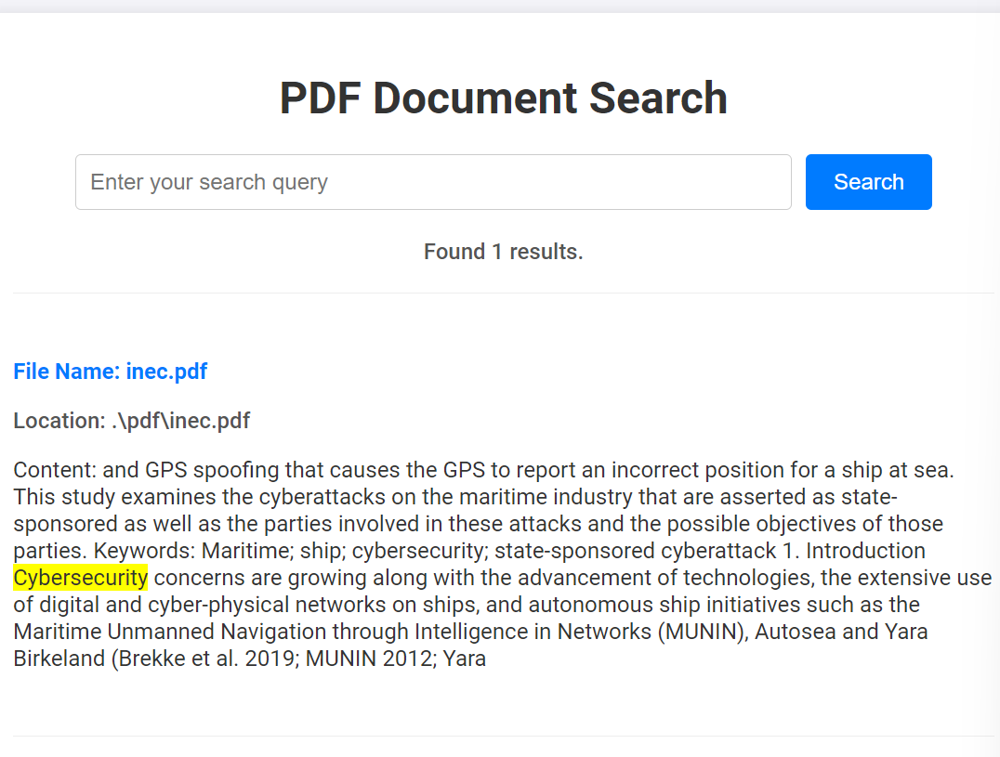

# creating a search engine for file ingestion

https://www.youtube.com/watch?v=vziwQjHk1Bk

https://www.youtube.com/watch?v=KSwPR9eig7w

First things that ran

streamlit app

creating an app without textual context

streamlit serve searchPdfApp.py

Using flask to run the server instead

# Issue to be taken care of 

1. search terms needs to be used together
2. creating a button for semantic search
3. add such that the pdf si accesible form the location on click

